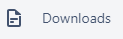
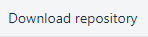

This test includes 8 assignments, which we want you to solve!

Please refrain from using the internet for scouting out solutions.
That is no fun! And we won't get a good sense of what you are actually capable of!

Each assignment has its own subfolder where you will find a Readme specifying the task and a project folder of the language of your choice - Java or C#. 

For C# a solution file with a project for each assignment is located in the "source" folder.

For Java individual src files are provided for each assignment.

Your delivery for this project should be a zipped version of the entire repository.

Good luck, and happy coding!

For a C# solution, we recommend the newest version of Visual Studio or Visual Studio Code.

For a Java solution, Java 8 is required.

# How do I download the test?
You can download the project either by cloning this git repository, or by pressing the shiny  button in the left pane, and selecting 